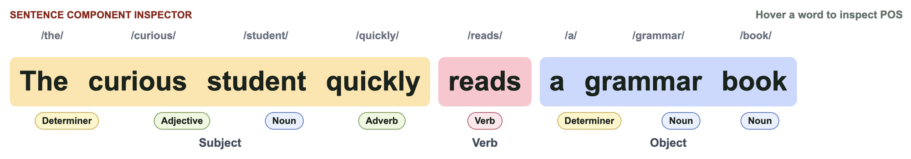
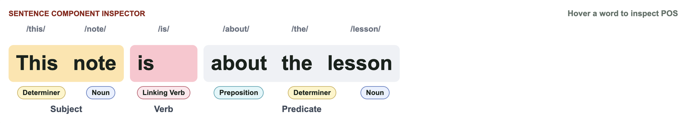
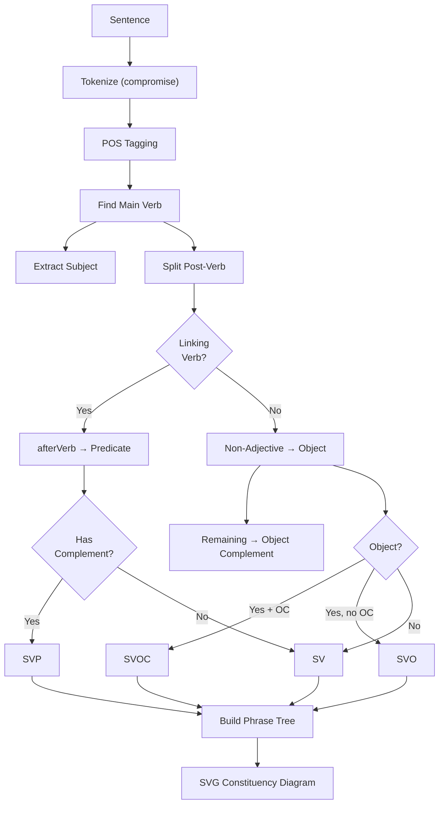

[**中文**](./README.zh.md) | English

---

# gramtree



Type an English sentence. See its grammar tree instantly — subject, verb, object, predicate, all laid out in a visual constituency parse.

## Why it matters

Most grammar tools are either textbook diagrams or black-box NLP pipelines. You can't see *why* a sentence parses the way it does. This tool bridges the gap: it classifies sentences into the classic five patterns (SV, SVO, SVP, SVOO, SVOC), labels every word's part of speech and sentence role, and draws a phrase-structure tree — all in real time, in your browser, with zero backend.

## What it does

- **Live constituency tree** — type a sentence and watch the tree redraw as you edit
- **Five-pattern classification** — detects SV / SVO / SVP / SVOO / SVOC patterns with confidence levels
- **Word-level inspection** — hover any word to see its POS tag, sentence component, and grammatical role
- **Role-labeled nodes** — every phrase node carries its role (Subject, Verb, Predicate, Object, etc.)

## Interaction Design Reference

The sentence-building interaction and game-like practice flow are inspired by [句乐部](https://julebu.ai/), especially its sentence-first English learning experience, instant feedback, and keyboard-driven practice style.

## Quick Start

```bash
npm install
npm run dev
# Open http://localhost:3000
```



## Examples

| Input | Pattern | Subject | Verb | Predicate / Object |
|---|---|---|---|---|
| `This note is about the lesson` | SVP | This note | is | about the lesson |
| `The curious student quickly reads a grammar book` | SVO | The curious student | reads | a grammar book |
| `She is happy in the classroom` | SVP | She | is | happy in the classroom |
| `My teacher will explain the visual tree` | SVO | My teacher | will explain | the visual tree |

## How it works



## Benchmarks / Proof

- **Zero external API calls** — all analysis runs in-browser via compromise (≈100KB gzipped)
- **Real-time** — re-parses on every keystroke with no perceptible delay (sentences under 20 words)
- **Deterministic** — the same sentence always produces the same tree and pattern classification

## Use Cases

- **ESL learners** — see why "She is happy" is SVP while "She reads a book" is SVO
- **Linguistics students** — visualize phrase structure without installing a full parser
- **Frontend developers** — study a self-contained pattern-matching grammar engine in ~300 lines of TypeScript

## Roadmap

- [ ] Support for SVOO / SVOC patterns (currently detected as fallthrough to SV / SVO)
- [ ] Multi-verb sentence support (coordinated VPs, subordinate clauses)
- [ ] Export tree as PNG / SVG
- [ ] Shareable URL with embedded sentence
- [ ] Dark mode

## Contributing

PRs are welcome. The core analysis lives in `lib/grammar.ts` (~300 lines) — the rest is a single-page Next.js app. To get started:

```bash
npm run dev     # development server
npm run build   # production build
npm run lint    # type-check
```
