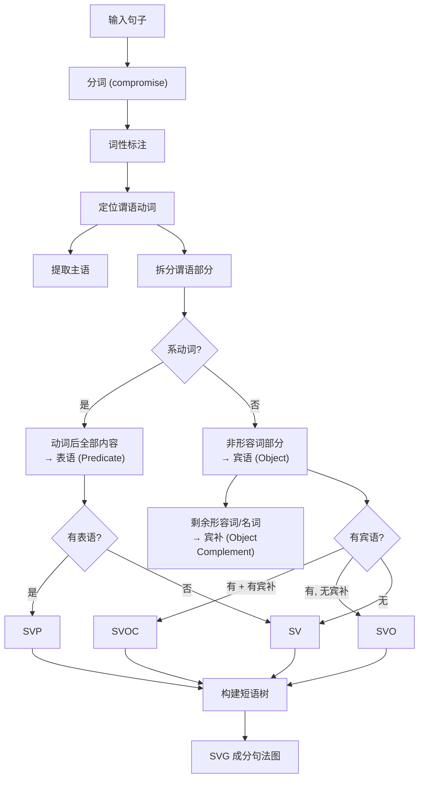

# gramtree — 英语语法可视化


输入英语句子，实时生成成分句法树 —— 主谓宾表定状补，一目了然。

## 为什么需要它

传统语法学习依赖死板的教科书图解，而 NLP 工具又只是黑盒输出 —— 你永远不知道它 *为什么* 这么分析。本项目填平了这条鸿沟：将句子归类为经典五大句型（SV、SVO、SVP、SVOO、SVOC），给每个单词标注词性和句法成分，并绘制短语结构树。纯浏览器端运行，无需后端，即输即得。

## 功能

- **实时句法树** — 输入句子，树随你编辑即时重绘
- **五大句型识别** — 自动识别 SV / SVO / SVP / SVOO / SVOC，附带置信度
- **逐词探查** — 鼠标悬停任意单词，查看词性、成分、语法角色
- **角色标签节点** — 每个短语节点都标注了成分角色（Subject、Verb、Predicate、Object 等）

## 交互设计参考

本项目的造句交互和游戏化练习玩法参考了 [句乐部](https://julebu.ai/)，尤其是它以句子为核心的英语学习体验、即时反馈和键盘驱动的练习节奏。

## 快速开始

```bash
npm install
npm run dev
# 打开 http://localhost:3000
```


## 示例

| 输入 | 句型 | 主语 | 谓语动词 | 表语 / 宾语 |
|---|---|---|---|---|
| `This note is about the lesson` | SVP | This note | is | about the lesson |
| `The curious student quickly reads a grammar book` | SVO | The curious student | reads | a grammar book |
| `She is happy in the classroom` | SVP | She | is | happy in the classroom |
| `My teacher will explain the visual tree` | SVO | My teacher | will explain | the visual tree |

## 原理



## 性能与特性

- **零外部 API 调用** — 全部分析在浏览器内完成（compromise ≈ 100KB gzip）
- **实时响应** — 每次按键即时重解析（20 词内句子无感知延迟）
- **确定性输出** — 相同句子始终产生相同的树和句型

## 适用场景

- **英语学习者** — 直观看到 "She is happy" 为什么是 SVP 而 "She reads a book" 是 SVO
- **语言学学生** — 无需安装完整解析器即可可视化短语结构
- **前端开发者** — 研究一个仅有 ~300 行 TypeScript 的自包含语法引擎

## 路线图

- [ ] SVOO / SVOC 完整支持（目前会降级为 SV / SVO）
- [ ] 多动词句子支持（并列谓语、从句）
- [ ] 导出为 PNG / SVG
- [ ] 可分享链接（保留句子参数）
- [ ] 深色模式

## 贡献

欢迎 Pull Request。核心分析逻辑在 `lib/grammar.ts`（约 300 行），其余为单页 Next.js 应用。

```bash
npm run dev     # 开发服务器
npm run build   # 生产构建
npm run lint    # 类型检查
```
