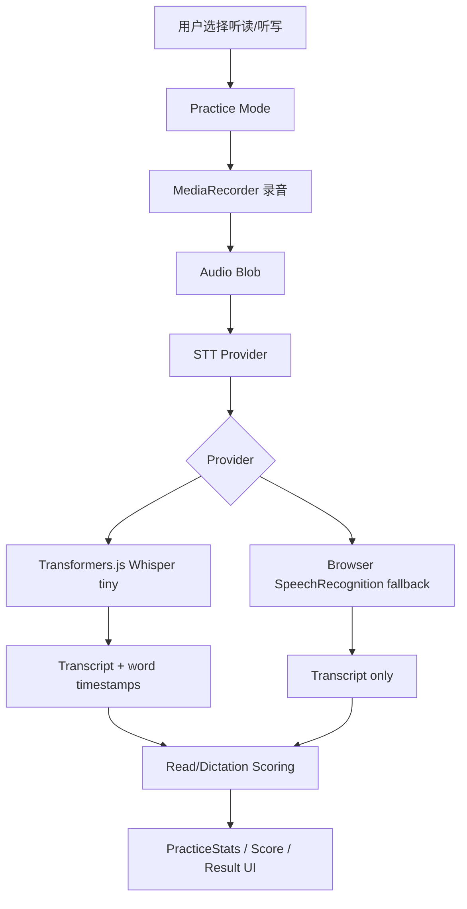

# 纯前端 Wasm ASR 方案草案

本文档调研“纯前端开源白嫖流”：在浏览器中通过 WebAssembly / WebGPU 跑轻量 ASR 模型，用于替代当前 `SpeechRecognition`，并为 gramtree 的 `听读` / `听写` 模式提供更稳定的跨浏览器 STT 能力。

文件状态：draft

## 背景

当前 gramtree 的听读模式依赖浏览器原生 `SpeechRecognition` / `webkitSpeechRecognition`。它的主要问题是：

- 浏览器兼容性不稳定。
- 识别质量由浏览器厂商控制。
- 无法获得可靠的音素级评分。

纯前端 Wasm ASR 的目标是把 STT 引擎从浏览器厂商 API 换成前端可控的开源模型推理。

## 调研来源

- Transformers.js 官方文档说明其目标是在浏览器中运行 Transformers 模型，并支持 audio automatic speech recognition；它基于 ONNX Runtime 运行模型。  
  https://huggingface.co/docs/transformers.js/index
- Transformers.js pipeline API 支持 `automatic-speech-recognition`。  
  https://huggingface.co/docs/transformers.js/api/pipelines
- Transformers.js WebGPU 文档给出了 `onnx-community/whisper-tiny.en` 的浏览器端 ASR 示例。  
  https://huggingface.co/docs/transformers.js/guides/webgpu
- `Xenova/whisper-tiny.en` 模型卡给出了 Transformers.js 用法，并展示了 `return_timestamps: true` 和 `return_timestamps: "word"` 的输出形式。  
  https://huggingface.co/Xenova/whisper-tiny.en
- ONNX Runtime Web 官方文档说明可在浏览器端使用 `onnxruntime-web`，可选 WebAssembly、WebGPU、WebGL、WebNN 等 execution provider，并列出隐私、离线、成本方面的优势与模型体积限制。  
  https://onnxruntime.ai/docs/tutorials/web/
- ONNX Runtime WebGPU 文档说明 WebGPU 适合更重的模型，WASM 适合轻量模型；WebGPU 在 Chrome/Edge 较好，Firefox/Safari 仍存在开关或预览限制。  
  https://onnxruntime.ai/docs/tutorials/web/ep-webgpu.html

## 结论

该方案技术上可行，但要明确边界：

- 适合解决“浏览器不支持 `SpeechRecognition`”的问题。
- 适合做 `听写` 模式的本地 STT。
- 适合做 `听读` 模式的单词级、句子完整度评分。
- 不替代专业 pronunciation assessment，因为 Whisper 输出仍然是文本转录。

推荐定位：

```text
浏览器 SpeechRecognition
  → 保留为轻量 fallback

Transformers.js + Whisper tiny
  → 作为纯前端 STT provider
  → 主要服务听写和粗粒度听读评分

后端 pronunciation assessment
  → 未来支持音素纠音和发音评分
```

## 目标与非目标

### 目标

- 不引入后端服务。
- 不使用付费 STT API。
- 在 Chrome、Edge、Safari、Firefox 等环境中尽量绕开 `SpeechRecognition` 兼容性问题。
- 复用当前 `MediaRecorder` 录音链路。
- 将 STT 实现抽象成 provider，便于未来迁移到后端 STT 或 pronunciation assessment。
- 在当前 `听读` / `听写` 模式中复用同一套识别结果结构。

### 非目标

- 不承诺音素级纠音。
- 不承诺低端手机实时识别。
- 不把大模型权重打进首屏 JS bundle。
- 不替代未来的专业发音评测。

## 推荐技术栈

### 首选封装

使用 `@huggingface/transformers`，而不是直接手写 ONNX Runtime Web 推理。

原因：

- 已封装 Whisper 的 tokenizer、processor、audio preprocessing 和 postprocessing。
- 提供 `pipeline("automatic-speech-recognition", modelId)` 高层 API。
- 可通过 `device: "webgpu"` 使用 WebGPU，也可回落到 WASM。
- 可通过 `dtype` 使用量化模型，降低下载和内存压力。

### 候选模型

优先试验：

```ts
"onnx-community/whisper-tiny.en"
```

或：

```ts
"Xenova/whisper-tiny.en"
```

选择原因：

- 英语专用，符合 gramtree 当前练习内容。
- 模型小，适合浏览器端加载。
- Hugging Face 模型卡已给出 Transformers.js 直接使用示例。
- 支持普通文本转录和 word-level timestamps。

## 与当前代码的关系

当前听读主流程在 `app/page.tsx` 中：

```text
toggleReadRecording()
  → startReadRecording()
  → getUserMedia()
  → MediaRecorder
  → SpeechRecognition
  → compareSpeechToTarget()
  → applyReadResult()
```

改造后建议变成：

```text
toggleReadRecording()
  → startReadRecording()
  → getUserMedia()
  → MediaRecorder
  → stopReadRecording()
  → AudioBlob
  → sttProvider.transcribe(blob)
  → compareTranscriptToTarget()
  → applyReadResult()
```

关键变化：

- `SpeechRecognition` 不再和录音同时运行。
- 停止录音后，把完整音频 blob 交给本地模型识别。
- 识别过程是异步推理，需要新增 `recognizing` 状态。
- UI 要区分“录音中”和“识别中”。

## Provider 抽象

当前已新增 `lib/stt/types.ts`，作为 STT provider 的共享接口：

```ts
export type SttWord = {
  text: string;
  start: number | null;
  end: number | null;
};

export type SttTranscript = {
  text: string;
  words: SttWord[];
  provider: "speech-recognition" | "transformers-whisper";
  model?: string;
};

export type SttProvider = {
  id: SttTranscript["provider"];
  isAvailable: () => Promise<boolean>;
  preload?: () => Promise<void>;
  transcribe: (audio: Blob, options?: SttOptions) => Promise<SttTranscript>;
};

export type SttOptions = {
  language?: "en";
  targetText?: string;
  returnWordTimestamps?: boolean;
};
```

当前 provider 文件：

```text
lib/stt/
  types.ts
  speechRecognitionProvider.ts
  transformersWhisperProvider.ts
  scoring.ts
```

- `SpeechRecognitionProvider`：保留旧浏览器原生方案，已标记 `deprecated: true`，仅作为兼容 fallback。
- `TransformersWhisperProvider`：新增纯前端 Whisper tiny provider，用于验证 Wasm/WebGPU ASR 路径。
- `scoreReadAttempt()`：新增单词级评分函数，用于把 transcript 与目标文本做粗粒度匹配。

## 本地 Whisper 推理流程

建议放在 Web Worker 中运行，避免阻塞 React UI。

```text
React UI
  → postMessage({ type: "load", model, device, dtype })
  → worker 加载 Transformers.js pipeline
  → postMessage({ type: "transcribe", audioBuffer })
  → worker 执行 transcriber(audio, { return_timestamps: "word" })
  → postMessage({ type: "result", transcript })
```

### 为什么需要 Worker

Whisper 推理会占用 CPU/GPU 和内存。即使用 WebGPU，音频 decode、特征处理、token decode 也会带来明显延迟。放在主线程会导致按钮、动画和页面滚动卡顿。

### 模型加载策略

不应在首页首屏加载模型。

建议：

```text
用户点击“听读”或“听写”
  → 显示模式页
  → 后台 preload 模型
  → 录音按钮可用前显示模型加载状态
```

或：

```text
用户第一次停止录音
  → 如果模型未加载，先加载模型
  → 加载完成后识别
```

第一种交互更可控，但首进听读会有等待。第二种首屏更快，但第一次识别等待更突兀。

## 音频输入格式

Transformers.js 示例支持从 URL 转录。实际集成时更适合把 `MediaRecorder` 的 blob 转为可解码音频输入：

```text
Blob
  → ArrayBuffer
  → AudioContext.decodeAudioData()
  → Float32Array mono PCM
  → transcriber(Float32Array)
```

注意点：

- Whisper 通常需要 16 kHz 音频输入，Transformers.js pipeline 可能会处理重采样，但要实测当前版本行为。
- Safari 对 `MediaRecorder` 输出格式支持和 Chrome 不完全一致，需要保留 decode 失败处理。
- 当前主流程保存 `recordingUrls[stageIndex]` 用于回放，这部分可以继续保留。

## 评分设计

### 听写模式

听写模式目标是判断用户是否听懂并输入正确。若引入 STT，则更像“口述答案”或“语音输入听写”。评分可以继续使用文本归一化：

```text
normalize(transcript.text) === normalize(stage.answer)
```

### 听读模式

听读模式目标是判断用户是否照着目标词/句读出来。纯前端 Whisper 只能做粗粒度评分：

```text
transcript words
  → normalize
  → target words
  → Levenshtein alignment
  → completeness / word accuracy
```

建议输出：

```ts
type ReadScore = {
  result: "recognized" | "try-again" | "not-matched";
  completeness: number; // 0-1
  wordAccuracy: number; // 0-1
  matchedWords: string[];
  missingWords: string[];
  extraWords: string[];
};
```

基本规则：

- 单词阶段：目标词被识别出来，则 `recognized`。
- 整句阶段：按目标词序列做编辑距离对齐，计算完整度和单词准确率。
- 若只匹配少量词，返回 `try-again`。
- 若完全没有匹配，返回 `not-matched`。

## 浏览器与性能评估

### WASM 路径

优点：

- 不依赖浏览器原生 `SpeechRecognition`。
- 兼容性通常比 WebGPU 好。
- 数据不离开用户设备。
- 可离线工作，但首次模型下载仍需要网络。

缺点：

- CPU 推理慢，尤其在低端手机上明显。
- 大模型下载和内存占用会影响体验。
- 长句识别可能延迟较高。

### WebGPU 路径

优点：

- 对 Whisper 这类模型性能更好。
- Chrome/Edge 新版本体验更有希望。

缺点：

- WebGPU 兼容性仍不完整。
- Safari / Firefox 可能需要 flag 或技术预览。
- GPU 初始化失败、显存不足、设备差异都要有 fallback。

建议策略：

```text
if WebGPU available:
  Transformers.js device = "webgpu"
else:
  Transformers.js device = "wasm"
```

但 `webgpu` 和 `wasm` 都需要实机基准测试，不应只靠能力检测决定默认策略。

## 缓存与部署

当前 gramtree 是 `output: "export"` + GitHub Pages 静态部署。纯前端模型方案与这个部署模型兼容，但需要处理模型资源缓存。

可选策略：

1. 从 Hugging Face Hub 远程加载模型。
   - 优点：不增加仓库体积。
   - 缺点：依赖第三方 CDN、首次加载不可控、离线不可用。

2. 将模型文件放到 `public/models/`。
   - 优点：部署资源可控，可和站点同源缓存。
   - 缺点：仓库和 gh-pages 体积变大。

3. 后续加 Service Worker 缓存模型。
   - 优点：二次进入体验好。
   - 缺点：需要额外缓存版本管理。

draft 阶段建议先远程加载 Hugging Face 模型，完成可行性验证后再决定是否自托管模型文件。

## UI 状态变化

听读按钮需要从二态扩展为三态：

```ts
type ReadUiState = "idle" | "recording" | "recognizing";
```

UI 文案：

- `idle`：点击开始跟读
- `recording`：点击结束录音
- `recognizing`：正在识别

按钮行为：

- `idle` → 点击 → 开始录音
- `recording` → 点击 → 停止录音并进入识别
- `recognizing` → 禁用按钮，避免重复提交

## 错误处理

需要覆盖：

- 浏览器不支持 `getUserMedia`。
- 用户拒绝麦克风权限。
- `MediaRecorder` 输出格式无法被 `AudioContext` decode。
- 模型下载失败。
- WebGPU 初始化失败。
- WASM 推理失败或内存不足。
- 识别超时。
- transcript 为空。

建议 fallback：

```text
Transformers.js WebGPU 失败
  → 尝试 Transformers.js WASM
  → 再失败则尝试 browser SpeechRecognition
  → 再失败则提示只能手动跳过/改用听写
```

## MVP 实施计划

### 阶段 1：Spike

目标：验证浏览器端 Whisper tiny 是否能在当前 Next.js + GitHub Pages 架构下跑通。

任务：

- 安装 `@huggingface/transformers`。
- 新增一个内部测试页：`/internal/asr-check`。
- 复用当前录音按钮，录音后调用 Transformers.js pipeline。
- 输出：
  - 模型加载耗时
  - 推理耗时
  - transcript
  - word timestamps
  - 设备信息和所用 backend

验收：

- Chrome 桌面可跑通。
- Chrome Android 或 iOS Safari 至少选一个实机测试。
- 记录首包/模型下载大小和首次识别耗时。

### 阶段 2：Provider 抽象

目标：把当前 `SpeechRecognition` 从 `app/page.tsx` 中抽离。

任务：

- 新增 `SttProvider` 接口。
- 实现 `browserSpeechProvider`。
- 实现 `transformersWhisperProvider`。
- 将主听读流程改为 provider 调用。

验收：

- 主流程行为不退化。
- 可以通过配置选择 provider。

### 阶段 3：听读评分

目标：把单纯 `compareSpeechToTarget()` 升级为可解释的单词级评分。

任务：

- 新增 `scoreReadAttempt(transcript, target)`。
- 使用编辑距离对齐目标词和识别词。
- 在 UI 上展示缺失词、额外词或匹配词。

验收：

- 单词阶段和整句阶段都能稳定输出 `recognized` / `try-again` / `not-matched`。
- 评分输出能解释匹配词、缺失词和额外词。

## 推荐架构图



## 决策建议

建议先做 spike，不建议直接替换生产逻辑。

原因：

- 模型下载体积、首次加载耗时和移动端性能是最大不确定性。
- WebGPU 并不能覆盖所有用户，WASM 性能需要实测。
- 纯前端 Whisper 更适合作为文本级 STT 能力，不应直接承诺发音评测能力。

如果 spike 结果可接受，可以把它作为 `SpeechRecognition` 的更可控替代方案；如果目标升级为发音评分，应继续规划后端 pronunciation assessment。
